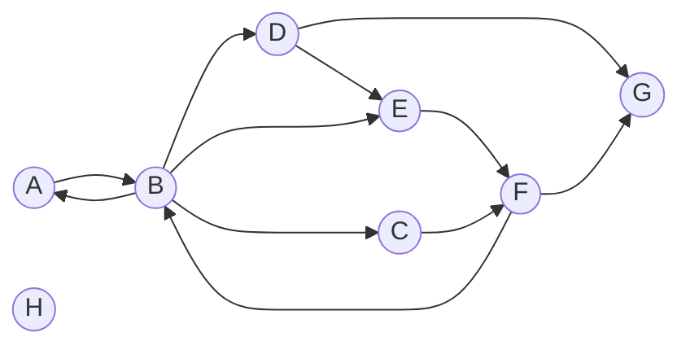

# ASD Interview Questions

## Instructions

- Fork this repository into your own GitHub account. If you don't have a GitHub account, please create one.
- Commit all your changes to your forked repository, following clean Git commit hygiene.
    - Demonstrate clean Git commit hygiene, following best practices for commit messages and organizing your commits.
    - For guidelines on clean Git commit hygiene, you can refer to [this source](https://cbea.ms/git-commit/).
- Place all your source code files in the `src` folder.
    - For each question, create a file for the solution.
    - If you are using JavaScript, name the files as `p1.js`, `p2.js`, `p3.js`, ...
    - If you have multiple solution proposals for a question, append `_n` to the file name (e.g. `p1_1.js`, `p1_2.js`, `p1_3.js`).
- You can use any programming language to solve the problems.
    - You can also use different programming languages for different problems if you see fit, but please explain your reasoning for selecting a particular language for each problem.
- The bonus challenge in each problem is optional but greatly welcomed. You can choose to tackle it if you'd like.
- Include comments in your code to explain your approach, algorithms, and any important details.
- Additionally, if possible, include test cases for your solutions.
    - For each solution file, create a separate file for tests (e.g. `p1.test.js`, `p1.test.js`, `p1.test.js`).
    - Test files should be placed in the same `src` folder.
    - Clearly indicate the expected outputs for the provided test cases.

## Problems

### Problem 1 - Sorting

Given a list of random unordered numbers, write a function that sort them in ascending order.

Input: 21, 400, 8, -3, 77, 99, -16, 55, 111, -36, 28

Expected output: -36, -16, -3, 8, 21, 28, 55, 77, 99, 111, 400

 def sort_numbers(numbers): //define the sort function - and the variable
    return sorted(numbers)

numbers = [21, 400, 8, -3, 77, 99, -16, 55, 111, -36, 28]
sorted_numbers = sort_numbers(numbers)
print(sorted_numbers)
Note:
- You are not allowed to use language library function to solve the problem.
- **Bonus**: Prepare space-time complexity analysis for your solution.

### Problem 2 - FizzBuzz

Given a list of ordered numbers from 1 to 100, perform the following actions
- For every number divisible by 3, print 'Fizz'
- For every number divisible by 5, print 'Buzz'
- For every number divisible by both 3 and 5, print 'FizzBuzz'

Input: 1, 2, 3, 4, 5, 6, 7, 8, 9, 10, 11, 12, 13, 14, 15, 16, 17, 18, 19, 20, ..., 100

Expected output: 1, 2, Fizz, 4, Buzz, Fizz, 7, 8, Fizz, Buzz, 11, Fizz, 13, 14, FizzBuzz, 16, ..., 100
do{
int a = 0;
printf("Enter numbers")
scanf("%d",&a);
}while(a <100);
for(int i=0; i<100; i++){
if(a %3 ==0)
printf("\nFizz")
else if(a %5 ==0)
printf("Buzz");
else if(a %5 == 0 && a%3 ==0)
printf("Fizzbuzz"):
else{
break();
}
}

### Problem 3 - Fibonacci Sequence

Write a function that generate Fibonacci sequence using `recursion` technique. Allow the user to specify the number of Fibonacci sequence elements to generate.

Expected output: 0, 1, 1, 2, 3, 5, 8, 13, 21, 34, ...
// in Java
class Fibbonaci{
public static void main(String [] args){
int n1 = 0, n2=1, n3,count = 0; //
System.out.print(n1+""+n2); 
System.out.printf("Enter the amount of  numbers needed",count); //let user input the numbers needed
for(int i=0; i<count; ++i){
n3 = n1+n2;
System.out.print(""+n3);
n1 = n2;
n2=n3;
}
}
}
Note:
- Fibonacci sequence is a sequence in which each number is the sum of the two preceding ones.
- **Bonus**: How would you handle preventing a stack overflow exception when generating a large sequence?

### Problem 4 - Find List Intersection

Write a function that find the intersection between two lists.

List 1: 4, 5, 2, 3, 1, 6

List 2: 8, 7, 6, 9, 4, 5

Expected output: 4, 5, 6

if strcmp(l1 == l2){

}
Note:
- You are not allowed to use language library function to solve the problem.
- **Bonus**: Prepare space-time complexity analysis for your solution.

### Problem 5 - Find List Symmetric Difference

Write a function that find the symmetric difference between two lists.

List 1: 4, 5, 2, 3, 1, 6

List 2: 8, 7, 6, 9, 4, 5

Expected output: 1, 2, 3, 7, 8, 9

//output
int array[]= {4,5,2,3,1,6};
int array2[]={8,7,6,9,4,5};

for(int i=0; i<array[]; i++){
if(!strcmp(l1 == l2){
printf("Symmetric difference =",array1[],array2[])
}
else{
break;
}
}
Note:
- You are not allowed to use language library function to solve the problem.
- **Bonus**: Prepare space-time complexity analysis for your solution.

### Problem 6 - Find Character with Maximum Occurence

Write a function that takes a string as input and finds the character that occurs the maximum number of times in the string. Return both the character and its occurrence count. If there are multiple characters with the same maximum occurrence, return any one of them.

Input: "Hello, world!"

Expected output: Character: 'l', Occurrence: 3
//solve the problem 
#include <stdio.h>
#include <wchar.h>
#include <locale.h>
#include <stdlib.h>

#define MAX_CHARS 0x10FFFF // Maximum Unicode code point

int main() {
    setlocale(LC_ALL, ""); // Set locale to handle Unicode characters

    wchar_t str[] = L"Hello, world!";
    int max_count = 0;
    int* char_count = calloc(MAX_CHARS, sizeof(int));
    wchar_t* max_chars = malloc(MAX_CHARS * sizeof(wchar_t));
    int max_chars_count = 0;

    if (char_count == NULL || max_chars == NULL) {
        printf("Memory allocation failed\n");
        return 1;
    }

    for (int i = 0; str[i] != L'\0'; i++) {
        if (iswalnum(str[i])) { // Check if the character is a letter or a number
            char_count[str[i]]++;
            if (char_count[str[i]] > max_count) {
                max_count = char_count[str[i]];
                max_chars_count = 1;
                max_chars[0] = str[i];
            } else if (char_count[str[i]] == max_count) {
                max_chars[max_chars_count] = str[i];
                max_chars_count++;
            }
        }
    }

    if (max_count == 0) {
        printf("No characters found\n");
    } else {
        wprintf(L"Characters: ");
        for (int i = 0; i < max_chars_count; i++) {
            wprintf(L"%lc ", max_chars[i]);
        }
        wprintf(L"Occurrence: %d\n", max_count);
    }

    free(char_count);
    free(max_chars);

    return 0;
}

Note:
- Consider case-sensitivity, so 'H' and 'h' are different characters.
- The input string may contain whitespaces and punctuation. Ignore whitespaces and punctuation.
- **Bonus**: Handle Unicode characters correctly. Unicode characters refer to characters that are part of the Unicode character set. The Unicode character set is a standard system that assigns a unique numerical value (code point) to every character, including letters, numbers, symbols, and special characters from various writing systems around the world. This includes characters from languages like Chinese, Arabic, Hindi, Cyrillic, etc, as well as special characters and symbols from various scripts.

### Problem 7 - Square Root

Write a function that calculates and returns the square root of a non-negative integer `x`. You can safely assume `x` is a perfect square, such as 4, 9, 16, 25, 36, and so on.
//solution
int sqrt(int x) {
    if (x < 0) {
        // Handle negative numbers
        throw std::runtime_error("Cannot calculate square root of a negative number");
    } else if (x == 0 || x == 1) {
        // Handle 0 and 1
        return x;
    }

    int start = 1;
    int end = x;
    int ans = 0;

    while (start <= end) {
        int mid = start + (end - start) / 2; // Avoid overflow
        long long square = (long long)mid * mid; // Avoid overflow
        if (square == x) {
            return mid;
        } else if (square < x) {
            start = mid + 1;
            ans = mid;
        } else {
            end = mid - 1;
        }
    }

    return ans;
}
Note:
- You are not allowed to use any built-in square root function or language library function to solve the problem.
- **Bonus**: Prepare space-time complexity analysis for your solution.

### Problem 8 - Anagram Checker

Write a function that takes two strings as input and checks if they are anagrams of each other. Anagrams are words or phrases formed by rearranging the letters of another word or phrase.

Example 1:
- Input: "listen", "silent"
- Expected output: true
- Explanation: Both strings contain the same characters "l", "i", "s", "t", "e", and "n" and have the same count for each character. Hence, they are anagrams of each other.

Example 2:
- Input: "debit card", "Bad credit"
- Expected output: true
- Explanation: After removing whitespace and ignore case sensitivity, both strings contain the same characters "d", "e", "b", "i", "t", "c", "a", and "r" and have the same count for each character. Hence, they are anagrams of each other.

Example 3:
- Input: "hello", "bye"
- Expected output: false
- Explanation: Both strings contain different characters and have different lengths. Hence, they are not anagrams of each other.

Example 4:
- Input: "restful", "fluster"
- Expected output: false
- Explanation: Both strings contain the same characters "r", "e", "s", "t", "f", "u", and "l", but the counts of each character are different. Hence, they are not anagrams of each other.

Example 5:
- Input: "listen", "silentt"
- Expected output: false
- Explanation: The first string contains the characters "l", "i", "s", "t", "e", and "n", while the second string contains an extra "t". Hence, they are not anagrams of each other.

Example 6:
- Input: "Conversation", "Voices, rant on"
- Expected output: true
- Explanation: After removing whitespace and punctuation and ignore case sensitivity, both strings contain the same characters "c", "o", "n", "v", "e", "r", "s", "a", "t", "i", and "n" and have the same count for each character. Hence, they are anagrams of each other, even though the second string has different words, whitespaces, punctuation and cases.
//solution
char a,b;
printf("Enter a word");
scanf("%s",&a);
rewind(stdin);
printf("Enter another word");
scanf("%s",&b);
if(strcmp(a,b == 0){  //checks each letter for similarities
return true;
else{
return false;
}
Note: 
- Ignore case sensitivity, so "Listen" and "silent" should be considered anagrams.
- Ignore whitespace and punctuation from the anagram check.
- **Bonus**: Prepare space-time complexity analysis for your solution.

### Problem 9 - Node Path Existence

You are given a directed graph represented by its nodes and edges. Each node is identified by a unique label. The nodes in graph may contain cycles or may not be connected. Write a function that takes the graph, start node, and end node as inputs and returns two pieces of information:

1. A boolean value indicating whether a connected path exists between the specified nodes.
2. The connected path itself, if it exists.

Here is an example of the graph:

Example 1:
- Input: Start = D, End = B
- Expected output: False

Example 2:
- Input: Start = F, End = A
- Expected output: True (F --> B --> A)

Example 3:
- Input: Start = G, End = C
- Expected output: False

Example 4:
- Input: Start = E, End = D
- Expected output: True (E --> F --> B --> D)

'\

char a,b,c,d,e,f,g;

Note:
- You are free to propose any data structure to represent the directed graph.
- **Bonus**: Ensure that the function always returns the shortest connected path if it exists (assuming each edge has the same weight).
